# 🧮 Excel-20

---

## ✨ Project Description

**Excel-20** is a practical guide to using the Solver Add-In and performing Sensitivity Analysis in Microsoft Excel.  
Find examples, clear explanations, and screenshots to help you use Solver efficiently for real decision-making problems.

> 📚 **Goal:** Help you optimize decisions and perform sensitivity analysis—ideal for both beginners and advanced users!

---

## 📒 Table of Contents

- [Solver](#-solver)
- [First Example: Product Mix](#-first-example-product-mix)
- [Named Ranges (Product Mix)](#-named-ranges-product-mix)
- [Second Example: Transportation Problem](#-second-example-transportation-problem)
- [Named Ranges (Transportation)](#-named-ranges-transportation)
- [Third Example: Shortest Path](#-third-example-shortest-path)
- [Named Ranges (Shortest Path)](#-named-ranges-shortest-path)
- [Sensitivity Analysis](#-sensitivity-analysis)
- [Screenshots](#-screenshots)
- [Requirements](#-requirements)
- [Author](#-author)

---

## 🧮 Solver

Excel includes a tool called **Solver** that uses techniques from operations research to optimize decisions in various problems.

To load the Solver Add-In:
1. On the File tab, click Options.
2. Under Add-ins, select **Solver Add-in** and click **Go**.
   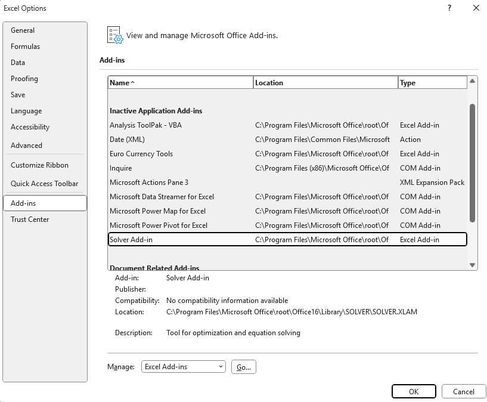
3. Check **Solver Add-in** and click **OK**.
   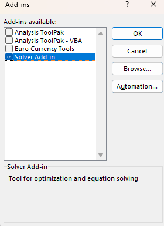
4. Find Solver on the **Data** tab, in the **Analyze** group.
   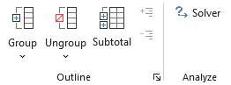

---

## 🏷️ First Example: Product Mix

The model to solve:
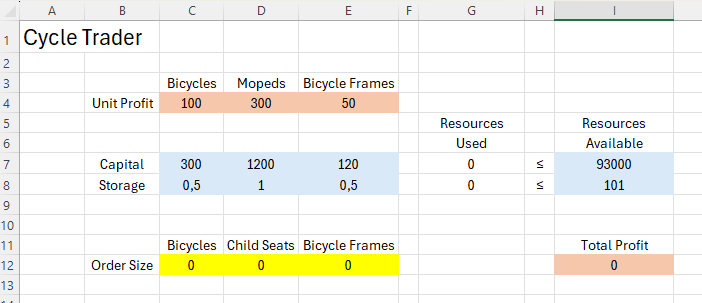

- Task: Find optimal order quantities for bicycles, mopeds, and child seats.
- Constraints: Capital and storage used must not exceed resources available.
- Objective: Maximize total profit.

---

## 🗂️ Named Ranges (Product Mix)

| 🔤 Range Name        | 📋 Cells    |
|---------------------|------------|
| UnitProfit          | C4:E4      |
| OrderSize           | C12:E12    |
| ResourcesUsed       | G7:G8      |
| ResourcesAvailable  | I7:I8      |
| TotalProfit         | I12        |

Insert the following three `SUMPRODUCT` functions as needed.  
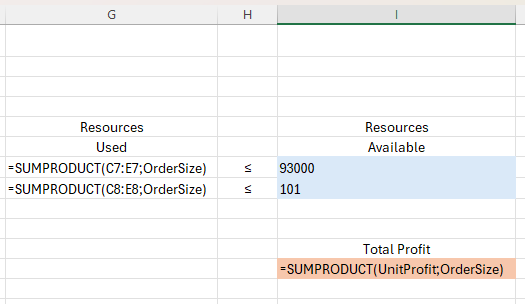

> 📝 **Tip:** You can use trial and error, but Solver finds the optimal solution quickly!

---

1. On the Data tab, in the Analyze group, click **Solver**.
2. Enter the Solver parameters as shown:
   
   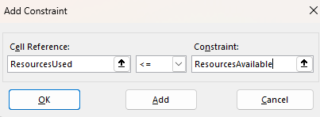
   - Check **Make Unconstrained Variables Non-Negative**
   - Select **Simplex LP**
3. Click **Solve**.

**Result:**
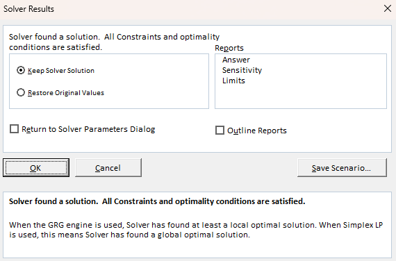
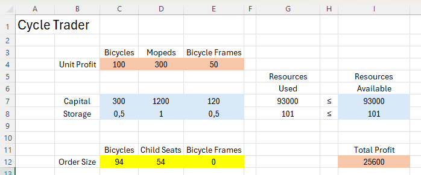

It is optimal to order **94 bicycles** and **54 mopeds** for a maximum profit of **25600**. All resources are used.

---

## 🚚 Second Example: Transportation Problem

- Task: Find how many units to ship from each factory to each customer to minimize total cost.
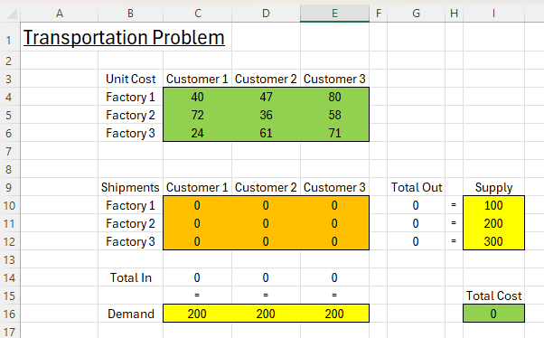

- Constraints: Each factory has a fixed supply, each customer has a fixed demand.
- Objective: Minimize total transportation cost.

---

## 🗂️ Named Ranges (Transportation)

| 🔤 Range Name        | 📋 Cells    |
|---------------------|------------|
| UnitCost            | C4:E6      |
| Shipments           | C10:E12    |
| TotalIn             | C14:E14    |
| Demand              | C16:E16    |
| TotalOut            | G10:G12    |
| Supply              | I10:I12    |
| TotalCost           | I16        |

Insert the required functions:  
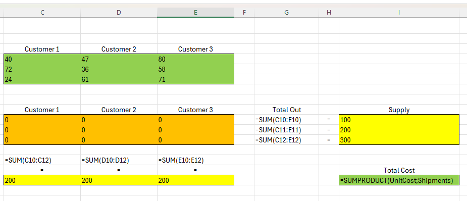

---

1. On the Data tab, click **Solver**.
2. Enter parameters as shown:
   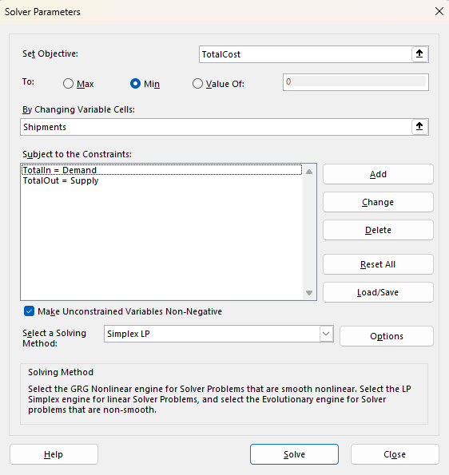
   - Add necessary constraints.
3. Click **Solve**.

**Result:**  
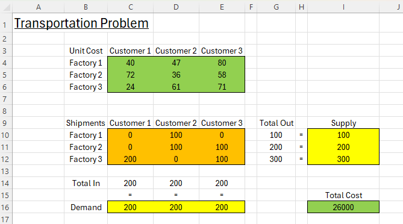

Minimum cost: **26000**. All constraints satisfied.

---

## 🚦 Third Example: Shortest Path Problem

- Task: Find the shortest path from node S to node T in an undirected network.
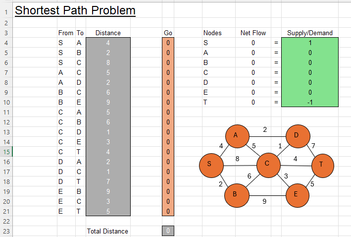

- Net Flow (Flow Out - Flow In) of each node should equal Supply/Demand.
- Objective: Minimize the total distance.

---

## 🗂️ Named Ranges (Shortest Path)

| 🔤 Range Name      | 📋 Cells    |
|-------------------|------------|
| From              | B4:B21     |
| To                | C4:C21     |
| Distance          | D4:D21     |
| Go                | F4:F21     |
| NetFlow           | I4:I10     |
| SupplyDemand      | K4:K10     |
| TotalDistance     | F23        |

Insert the necessary functions:  

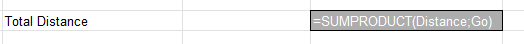

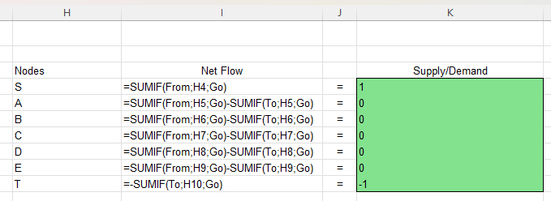

---

1. On the Data tab, click **Solver**.
2. Enter parameters as shown:
   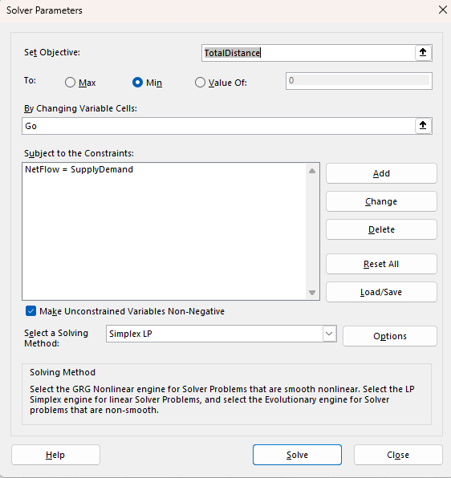
3. Click **Solve**.

**Result:**  
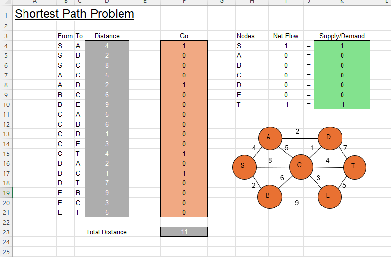

Shortest path: **S → A → D → C → T** (Total distance = 11).

---

## 🧪 Sensitivity Analysis

Sensitivity analysis shows how the optimal solution changes when coefficients in the model change.

- Use Solver for the first example.
- Before clicking OK, choose **Sensitivity** from the Reports section.
  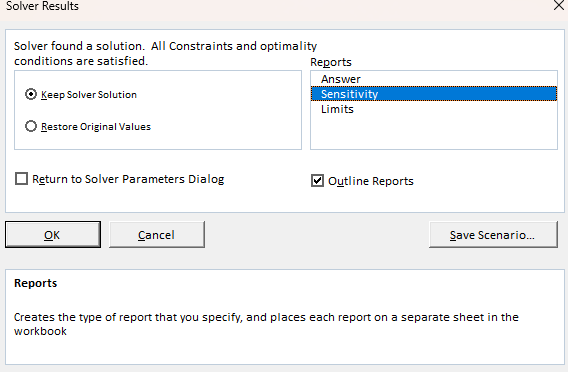

See the report:
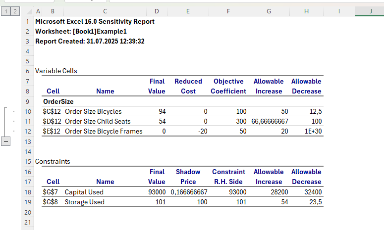

- **Reduced Cost:** How much objective coefficients (unit profits) can change before the solution changes.
- **Shadow Price:** How much the optimal solution changes if right-hand side values (resources) change by one unit.

---

## 📷 Screenshots

All screenshots referenced above can be found in the `/Screenshots` folder.

---

## ℹ️ Requirements

- Microsoft Excel (recommended: 2021/365 for modern formulas)
- Solver Add-In enabled

---

## 👨‍💻 Author

Project and documentation by **Kuba27x**  
Repository: [Kuba27x/Excel-20](https://github.com/Kuba27x/Excel-20)

---
