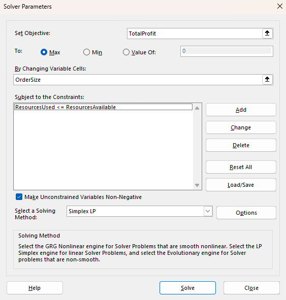

Excel-20

Project Description

Excel-20 is a practical guide to learning Solver Add-In in Microsoft Excel. Find examples, clear explanations, and screenshots to help you use Solver efficiently.

Table of Contents

Solver

Excel includes a tool called Solver that uses techniques from operations research, a field focused on optimizing decisions, to solve all kinds of problems.

Load the Solver Add-in

1. On the File tab, click Options.
2. Under Add-ins, select Solver Add-in and click on the Go button.

3. Check Solver Add-in and click OK.

4. You can find the Solver on the Data tab, in the Analyze group.

First Example

The model we are going to solve looks as follows in Excel.

For this problem, we need Excel to find out how much to order of each product (bicycles, mopeds and child seats).

The constraints here are that the amount of capital and storage used by the products cannot exceed the limited amount of capital and storage (resources) available.

The overall measure of performance is the total profit of the three products, so the objective is to maximize this quantity.

To make the model easier to understand, create the following named ranges.

Range Name	Cells
UnitProfit	C4:E4
OrderSize	C12:E12
ResourcesUsed	G7:G8
ResourcesAvailable	I7:I8
TotalProfit	I12

Insert the following three SUMPRODUCT functions.

You can try and use trial and error method to solve it but Excel Solver can be used to quickly find the optimal solution.

1. On the Data tab, in the Analyze group, click Solver.
2. Enter the Solver parameters. The result should be consistent with the picture below.

You have the choice of typing the range names or clicking on the cells in the spreadsheet.

(Note: To add a constraint click Add.)

Make sure to check 'Make Unconstrained Variables Non-Negative' and select 'Simplex LP'.

3. Click Solve.

Result:

The optimal solution:

It is optimal to order 94 bicycles and 54 mopeds. This solution gives the maximum profit of 25600. This solution uses all the resources available.

Second Example

Transportation Problem

Use the solver in Excel to find the number of units to ship from each factory to each customer that minimizes the total cost.

The model we are going to solve looks as follows in Excel.

For this problem, we need Excel to find out how many units to ship from each factory to each customer.

Each factory has a fixed supply and each customer has a fixed demand.

The overall measure of performance is the total cost of the shipments, so the objective is to minimize this quantity.

To make the model easier to understand, create the following named ranges.

Range Name	Cells
UnitCost	C4:E6
Shipments	C10:E12
TotalIn	C14:E14
Demand	C16:E16
TotalOut	G10:G12
Supply	I10:I12
TotalCost	I16

Insert the following functions.

1. On the Data tab, in the Analyze group, click Solver.
2. Enter the solver parameters. The result should be consistent with the picture below.

Make sure to add constraints.

3. Click Solve.

The optimal solution:

This solution gives the minimum cost of 26000. All constraints are satisfied.

Third Example

Shortest Path Problem

Use the solver in Excel to find the shortest path from node S to node T in an undirected network.

The model we are going to solve looks as follows in Excel.

For this problem, we need Excel to find out if an arc is on the shortest path or not (Yes=1, No=0).

The Net Flow (Flow Out - Flow In) of each node should be equal to Supply/Demand. 

The overall measure of performance is the total distance of the shortest path, so the objective is to minimize this quantity.

To make the model easier to understand, create the following named ranges.

Range Name	Cells
From	B4:B21
To	C4:C21
Distance	D4:D21
Go	F4:F21
NetFlow	I4:I10
SupplyDemand	K4:K10
TotalDistance	F23

Insert the following functions.

1. On the Data tab, in the Analyze group, click Solver.
2. Enter the solver parameters. The result should be consistent with the picture below.

3. Click Solve.

The optimal solution:

S -> A -> D -> C -> T is the shortest path with a total distance of 11.

Sensitivity Analysis

Sensitivity analysis gives you insight into how the optimal solution changes when you change the coefficients of the model.

Use solver for first example here.

1. Before you click OK, select Sensitivity from the Reports section.

Below you can find the sensitivity report.

Reduced Cost

The reduced costs tell us how much the objective coefficients (unit profits) can be increased or decreased before the optimal solution changes.

Shadow Price

The shadow prices tell us how much the optimal solution can be increased or decreased if we change the right hand side values (resources available) by one unit.

